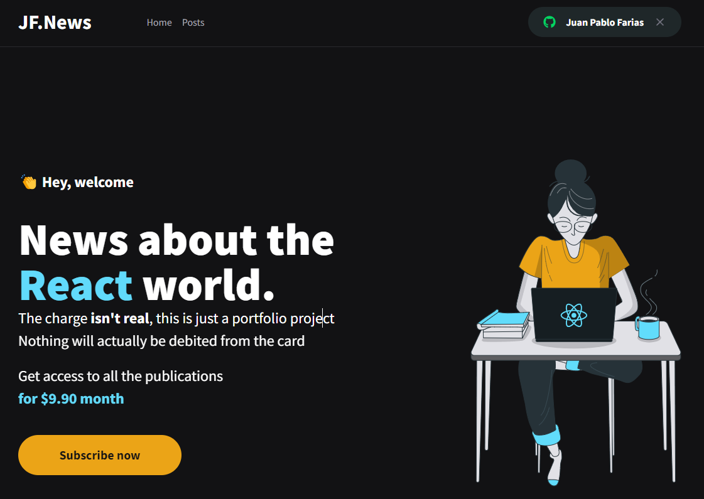
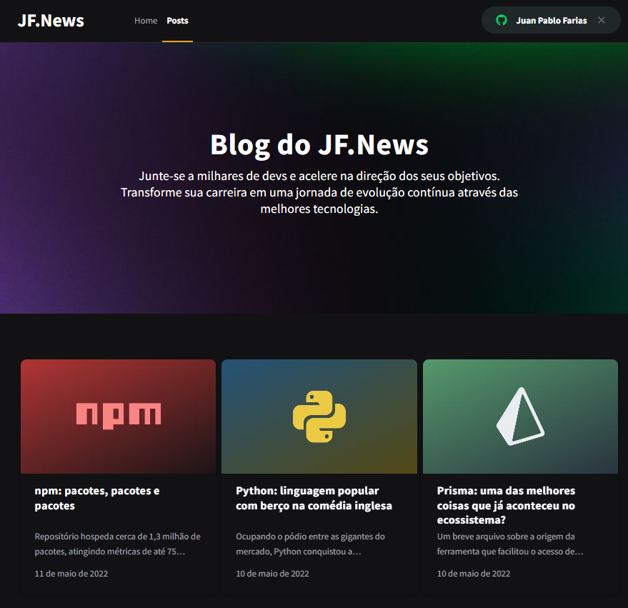
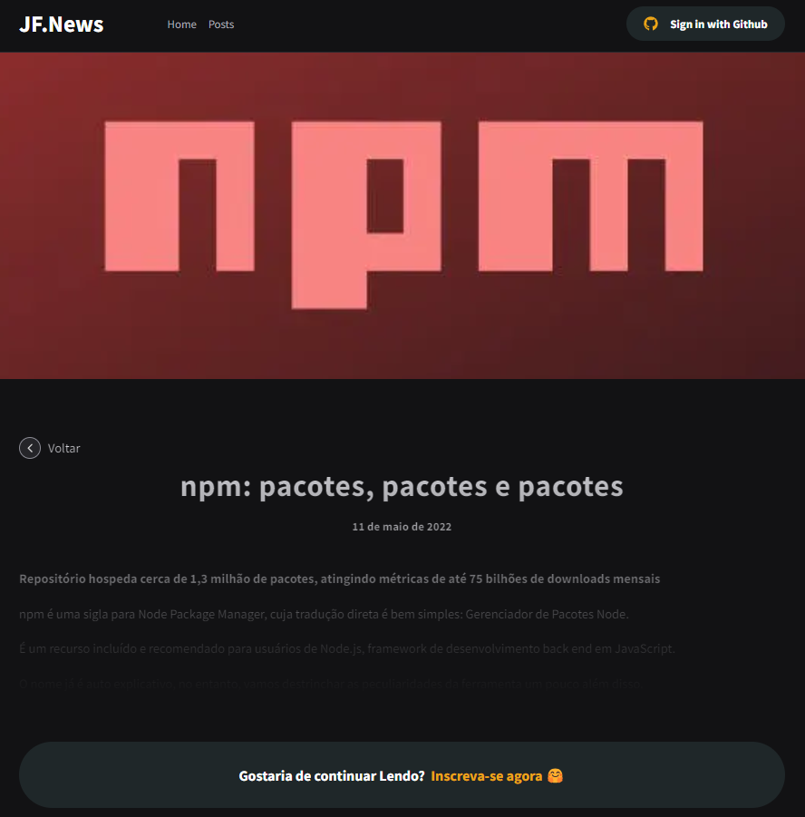
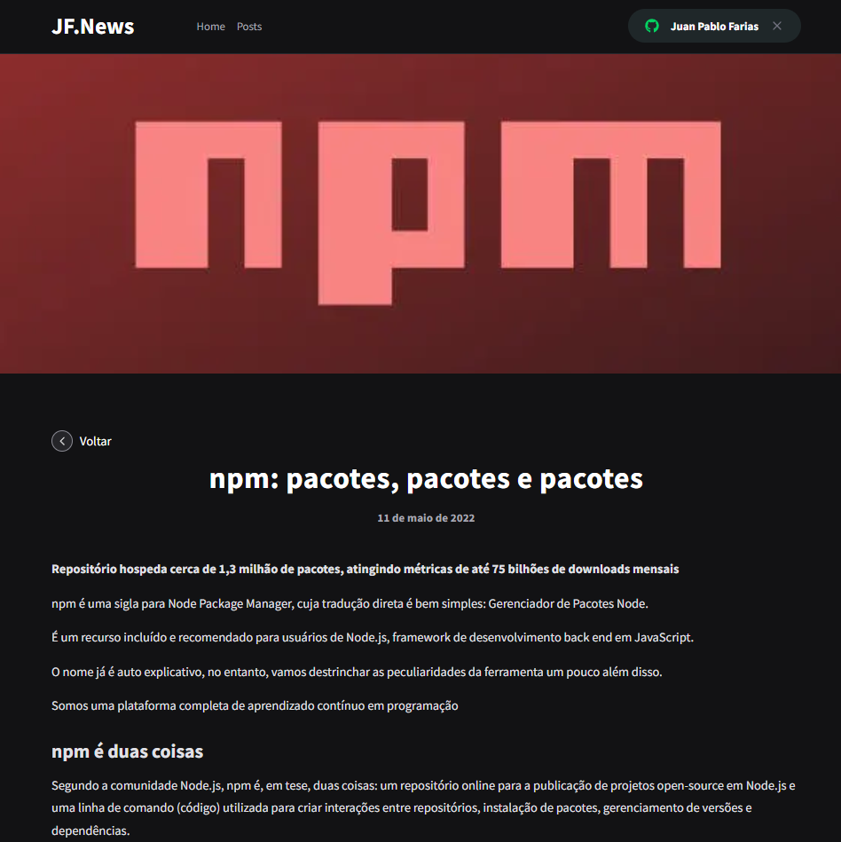

<h1 align="center">
  JF.News
</h1>

<h1 align="center">
    JF.News - Next.js
</h1>
<p align="center">Aplicação de um blog, com conteúdo limitado para não assinantes com pagamento via stripe</p>


<p align="center">
 • <a href="#sobre-o-projeto">Sobre o Projeto</a>
 • <a href="#tecnologias">Tecnologias</a>
 • <a href="#configurações-necessárias">Configurações necessárias</a>
 • <a href="#site-em-produção">Site em Produção</a>
 • <a href="#licença">Licença</a>
</p>

## 🎯 Sobre o projeto

O projeto tem como objetivo o estudo e desenvolvimento de um blog ultilizando NextJS, Next-Auth, FaunaDB e o Prismic CMS.

A aplicação foi desenvolvida utilizando o NextJS com as funções de consumo de API externas, Server Side Rendering (SSR) e Static Site Generation (SSG)
STRIPE para pagamentos das subscriptions
NextAuth para autenticação com Github
FaunaDB para armazenar as informações do usuário em um banco de dados
Prismic CMS para adição e gerenciamento do conteúdo dos posts.

O projeto original foi desenvolvido como pratica das aulas do modulo 03 do [Ignite da Rocketseat](https://rocketseat.com.br/)
---

## 🚀 Tecnologias

Tecnologias utilizadas para construção da aplicação

- [ReactJS](https://reactjs.org/)
- [NextJS](https://nextjs.org/)
- [TypeScript](https://www.typescriptlang.org/)
- [SASS](https://sass-lang.com/)
- [Next-Auth](https://next-auth.js.org/)
- [Stripe](https://stripe.com/)
- [FaunaDB](https://fauna.com/)
- [Prismic CMS](https://prismic.io/)
---

## Configurações necessárias

### ✅ **Requisitos**

Necessário realizar as instalações:

- [Git](https://git-scm.com/)
- [Yarn](https://classic.yarnpkg.com)
- [Stripe CLI](https://stripe.com/docs/stripe-cli)

Criar conta e configurar os serviços externos:

- [Stripe](https://stripe.com/)
- [FaunaDB](https://fauna.com/)
- [Prismic CMS](https://prismic.io/)

*Configurações dos serviços estão localizadas no arquivo servicesConfig.md na raiz do projeto.*

### 🏁 **Clone do projeto**

```bash
# Execute o comando git clone para realizar o clone do repositório
$ git clone https://github.com/juanfariasdev/ignews.git
# Entre na pasta do repositório clonado
$ cd ignews
```

### **Iniciando o projeto**

```bash
# Execute yarn para instalar as dependências
$ yarn

# Na raiz do projeto crie uma copia do arquivo .env.local.example
# Altere o nome da copia para .env.local
# Preencha as variáveis ambiente de acordo com as instruções
$ cp .env.local.example .env.local

# Execute stripe listen para ouvir eventos do webhook
$ stripe listen --forward-to localhost:3000/api/webhooks 

# Para iniciar a aplicação
$ yarn dev

```

---
## Site em Produção

A aplicação está atualmente em produção. Confira [aqui](https://ignews-two-iota.vercel.app)

---

## Licença

Distribuído sob a licença MIT. Veja [LICENSE](LICENSE) para mais informações.

---

## Autor

Feito por Juan Pablo Farias 👋

Documentação Baseado na do https://github.com/nelsonsantosaraujo/ignews


## Prints



### Caso não tenha pago:


### Caso tenha pago:

